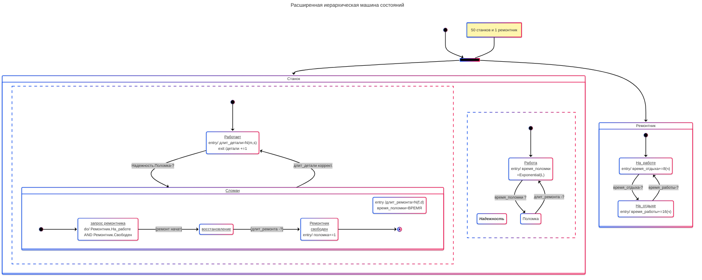
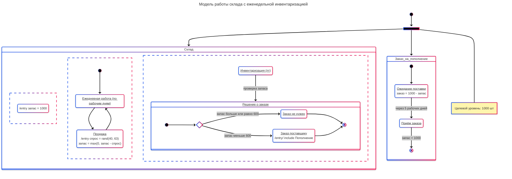

```mermaid
---
title: Расширенная иерархическая машина состояний
config:
    theme: neo
    look: neo
---
stateDiagram-v2
direction TB
state maintain <<fork>>
[*] --> maintain
maintain --> Станок
maintain --> Ремонтник
note left of maintain
50 станков и 1 ремонтник
end note

state Станок {
working:<u>Работает</u><br>entry/ длит_детали=N(m,s)<br>exit /детали +=1
failed: <u>Сломан</u>
[*] --> working
working --> failed :Надежность.Поломка-?
failed --> working :длит_детали коррект.
--
accTitle: <em><b>Надежность</b></em>
work: <u>Работа</u><br>entry/ время_поломки<br>=Exponential(L)
[*] --> work
work --> Поломка : время_поломки ?
Поломка --> work : длит_ремонта -?
}

state Ремонтник {
startwork : <u>На_работе</u><br>entry/ время_отдыха+=8(ч)
endwork : <u>На_отдыхе</u><br>entry/ время_работы+=16(ч)
[*] --> startwork
startwork --> endwork :время_отдыха-?
endwork --> startwork :время_работы-?
}

state failed {
ent: entry /длит_ремонта=N(f,d)<br>время_поломки=ВРЕМЯ
request_fixer: <u>запрос ремонтника</u><br>do/ Ремонтник.На_работе AND Ремонтник.Свободен
wait_repair: <u>восстановление</u>
release_fixer: <u>Ремонтник<br>свободен</u><br> entry/ поломка+=1
direction LR
[*] --> request_fixer
request_fixer --> wait_repair :[ремонт начат]
wait_repair --> release_fixer:[длит_ремонта -?]
release_fixer --> [*]
}
```
---

```mermaid
---
config:
  theme: neo
  look: neo
title: Модель работы склада с еженедельной инвентаризацией
---
stateDiagram
  direction TB
  state fork_initial <<fork>>
  state Склад {
    savings
--
    direction TB
    [*] --> work
    work --> sales
    sales --> work
--  
    inventory --> decision:проверка запаса
    
    state decision {
      direction LR
      state if_order <<choice>>

      [*] --> if_order
      if_order --> no_order:запас больше или равно 600
      no_order --> [*]
      if_order --> place_order:запас меньше 600
      place_order --> [*]
      if_order
[*]      no_order
[*]      place_order
    }
  }
  state Заказ_на_пополнение {
    direction TB
    [*] --> wait
    wait --> receive:через 5 рабочих дней
    receive --> [*]:запас = 1000
[*]    wait
    receive
[*]  }
  [*] --> fork_initial
  fork_initial --> Склад
  fork_initial --> Заказ_на_пополнение

  work:<u>Ежедневная работа (по рабочим дням)</u>
  inventory:<u>Инвентаризация (пт)</u>
  decision:<u>Решение о заказе</u>
  no_order:<u>Заказ не нужен</u>
  place_order:<u>Заказ поставщику</u> <br>/entry/ include Пополнение
  wait:<u>Ожидание поставки</u> <br> заказ = 1000 - запас
  receive:<u>Приём заказа</u>
  sales:<u>Продажа</u> <br> /entry спрос = rand(40, 63) <br> запас = max(0, запас - спрос) 
  savings: /entry запас = 1000
  note right of fork_initial 
  Целевой уровень: 1000 шт 
  end note

```
